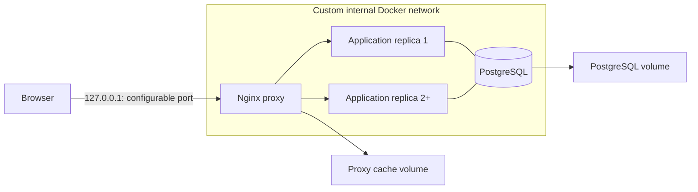

# Terraform Docker Local Environment

[](https://github.com/German4341374/terraform-docker-local-environment/actions/workflows/terraform.yml)

A local-only infrastructure-as-code portfolio project. Terraform and the Docker provider create an
Nginx reverse proxy, configurable application replicas, PostgreSQL, a custom network, and persistent
volumes without a cloud account.

## Architecture



Only Nginx publishes a loopback port. PostgreSQL and application containers remain internal.

## Technology stack

- Terraform 1.15.8 in CI
- `kreuzwerker/docker` provider 4.5.0
- Nginx Unprivileged 1.30.3, Traefik Whoami 1.11.0, PostgreSQL 17.4
- Terraform native tests, TFLint 0.63.1, Checkov 3.3.8, GitHub Actions

## Repository layout

- `versions.tf`, `providers.tf`: Terraform/provider constraints and local Docker connection.
- `variables.tf`, `locals.tf`, `outputs.tf`: public interface, validation, naming, and results.
- `images.tf`, `network.tf`, `volumes.tf`, `containers.tf`: focused resources.
- `environments/`: non-secret development and staging examples.
- `scripts/`: guarded init, plan, apply, health, and destroy operations.
- `tests/`: mocked plans validating defaults, replicas, and invalid ports.

## Prerequisites

Use Linux or Windows with WSL2. Install Docker Engine or Docker Desktop WSL2 integration,
Terraform 1.8+, TFLint, Checkov, GNU Make, Bash, and curl. No cloud credentials are needed.

## Installation and usage

Generate a local password and keep it in the shell rather than a file:

```bash
export TF_VAR_postgres_password="$(openssl rand -base64 24)"
make setup
make lint
make test
make plan ENV=development
```

Read `plans/development.txt`, then apply the exact saved binary plan:

```bash
make up ENV=development
make health
terraform output
```

Destroying also removes Terraform-managed volumes and their data:

```bash
make down ENV=development
```

The scripts require explicit `APPLY` or `DESTROY` confirmation.

## Environment configuration

| Setting | Development | Staging example |
|---|---:|---:|
| Proxy port | 8080 | 8081 |
| Application replicas | 2 | 3 |
| Internal network | enabled | enabled |

`postgres_password` is intentionally absent from committed tfvars. Supply it through
`TF_VAR_postgres_password`. Variables validate environments, names, ports, replica bounds,
password length, local Docker socket schemes, and non-`latest` image tags.

## Verification commands

```bash
terraform fmt -check -recursive -diff
terraform validate
terraform test
tflint --recursive
checkov --directory . --framework terraform
terraform plan -refresh=false -var-file=environments/development.tfvars
curl --fail http://127.0.0.1:8080/health
docker ps --filter label=managed-by=terraform
```

## Terraform state

Terraform state maps resource addresses to real Docker IDs and stores attributes used to calculate
changes. It can contain sensitive values—including the PostgreSQL password inside container
environment configuration—even when CLI output is marked sensitive. State is therefore gitignored
and must never be committed, pasted into issues, or uploaded as an artifact. This local project uses
the default local backend; teams need an encrypted, access-controlled, locked remote backend.

Deleting state does not delete containers; it makes Terraform forget ownership. Recover or import
resources rather than creating a second conflicting state.

## Manual Docker versus Terraform

| Manual `docker run` | Terraform Docker provider |
|---|---|
| Fast for one experiment | Repeatable declared topology |
| Operator tracks flags and order | Dependency graph determines order |
| Drift is hard to identify | Plan shows proposed reconciliation |
| Scaling means repeated commands | `app_replicas` drives `for_each` |
| Cleanup relies on memory/scripts | State tracks managed resources |
| Easy ad-hoc mutation | Reviewable version-controlled configuration |

Terraform adds state and lifecycle complexity; it is valuable when reproducibility and review matter.

## GitHub Actions safety

CI has only `contents: read`. It initializes without a remote backend, runs fmt, validate, mocked
tests, TFLint, and Checkov, then creates a non-applying development plan with `-refresh=false`.
Only human-readable plan text is uploaded for seven days. Binary plans and state are never uploaded.
There is no `terraform apply` command in the workflow, so untrusted pull requests cannot mutate Docker.

## Troubleshooting

- **Docker connection refused:** start Docker and verify `docker info` from the same WSL shell.
- **Password validation fails:** export a value at least 16 characters long.
- **Port conflict:** override `proxy_port` in a local tfvars copy or choose staging.
- **Container unhealthy:** inspect `docker logs` and `terraform state show` for the resource.
- **State lock remains after interruption:** ensure no Terraform process runs before deleting the local lock file.
- **Resource already exists:** import it or remove it deliberately; do not delete state to hide drift.

## Security considerations

- Proxy binds to `127.0.0.1`; PostgreSQL has no published port.
- Application and proxy containers are read-only, drop all capabilities, and use no-new-privileges.
- Images use explicit version tags; production systems should additionally pin digests.
- Sensitive output redaction protects terminal display, not state contents.
- Local Docker socket access is effectively root-equivalent and should remain limited to trusted users.

## Limitations

- The Docker provider is useful for learning, not a replacement for production orchestration.
- Local state has no remote locking, encryption service, or team access controls.
- The example applications do not use PostgreSQL; the database demonstrates topology and persistence.
- Image tags are pinned but not digest-pinned.
- CI produces a plan but intentionally does not apply or perform live endpoint health verification.

## Future improvements

- Pin image digests and add container vulnerability scanning.
- Add encrypted remote-state examples without requiring them for local mode.
- Add import and state-recovery exercises and scheduled restore testing.
- Add policy-as-code rules for loopback binding and prohibited privileged containers.

## Interview talking points

- Why state is both Terraform's advantage and its primary security responsibility.
- How `for_each`, locals, validation, and saved plans improve repeatability.
- Why PR automation plans but never applies.
- Why sensitive outputs do not encrypt state.
- Trade-offs between Docker commands, Compose, Terraform, and an orchestrator.

See `DEMO.md`, `INTERVIEW.md`, and the `docs/` directory.

## License

MIT. See `LICENSE`.
